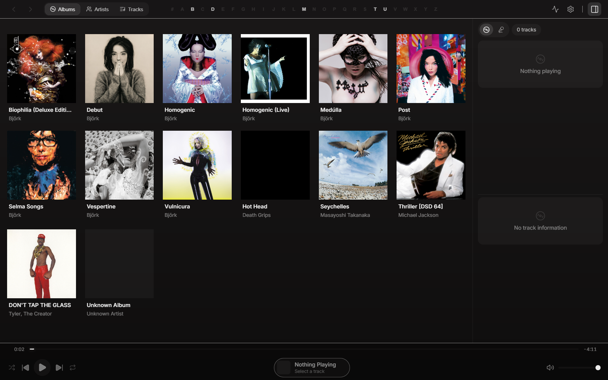
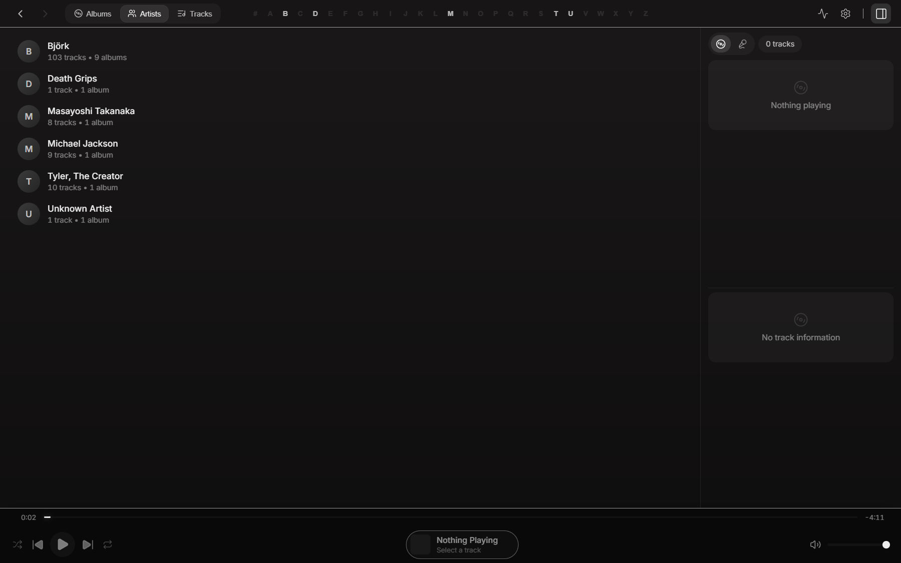
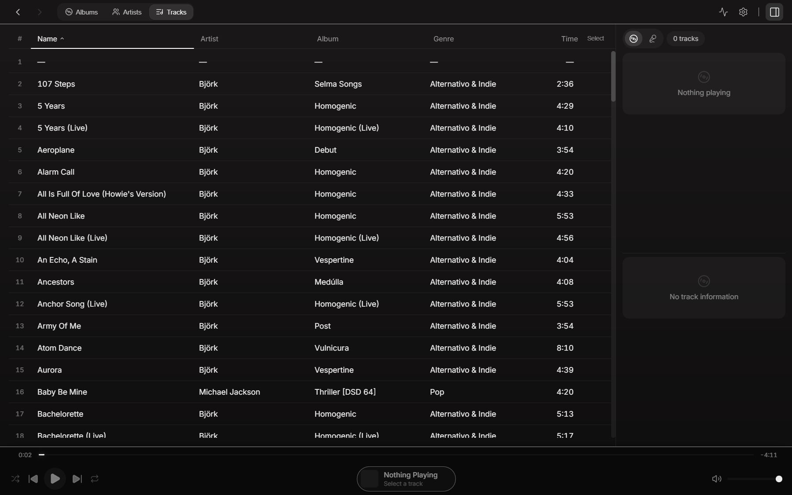

# UI/UX Aesthetic Redo 2026 - Review Pack

## Overview

This document captures the before/after evidence for the 2026 Brutalist-Matte redesign of Sermon.

**Design Language**: Dark Brutalist Minimal
- True black base (#0a0a0a)
- Matte surfaces (white 4%, 8%)
- Grayscale selection states (NO accent for selections)
- Accent color ONLY for buttons + focus ring
- Grayscale waveform/progress bar
- Artwork wash only in Now Playing view
- Frameless window with custom controls

---

## Before/After Comparison

### Albums View

| Before | After |
|--------|-------|
|  |  |

**Changes**:
- Removed glass/blur effects
- Matte surface backgrounds
- Crisp 1px hairline borders
- Grayscale hover states

---

### Artists View

| Before | After |
|--------|-------|
|  |  |

**Changes**:
- Matte card styling
- Removed gradient overlays
- Clean typography hierarchy

---

### Tracks View

| Before | After |
|--------|-------|
|  |  |

**Changes**:
- Grayscale selection states (no accent in row backgrounds)
- Matte table styling
- Improved density for large libraries
- Grayscale progress bar

---

### Now Playing View

| Before | After |
|--------|-------|
|  |  |

**Changes**:
- Artwork wash background (only view with wash)
- Signal path display with tech info (codec, bit depth, sample rate)
- Matte layout with strong hierarchy
- Removed noise texture

---

### Preferences View

| Before | After |
|--------|-------|
|  |  |

**Changes**:
- Simplified appearance settings:
  - Accent color picker (palette + hex)
  - Waveform seekbar toggle
  - Waveform style selector
  - Cover-art rounding toggles
  - Sidebar visibility
- Removed legacy options:
  - No waveform color (grayscale only)
  - No glass/blur sliders
  - No reduce-effects toggle (OS-level only)
  - No background intensity controls

---

### Diagnostics View

| Before | After |
|--------|-------|
|  |  |

**Changes**:
- Matte styling consistent with design language
- Signal path section maintained for audiophile diagnostics

---

## Accessibility Snapshots

- `baseline-topbar-a11y.yml` - TopBar accessibility tree
- `baseline-preferences-a11y.yml` - Preferences accessibility tree

---

## Shell Components (Additional)

### Bottom Bar

| Before |
|--------|
|  |

**Changes applied**:
- Grayscale progress bar (R=G=B)
- Matte surface styling
- Waveform seekbar respects grayscale design
- Accent color only on play/pause button

---

## Frameless Window

**Configuration**: `src-tauri/tauri.conf.json` → `decorations: false`

**Custom Controls**:
- Minimize, Maximize/Restore, Close buttons in TopBar
- Double-click on titlebar toggles maximize
- Drag regions properly configured

---

## Design Token Summary

### Surfaces
- `--surface-base`: #0a0a0a (true black)
- `--surface-1`: rgba(255,255,255,0.04)
- `--surface-2`: rgba(255,255,255,0.08)
- `--surface-3`: rgba(255,255,255,0.12)

### Text Hierarchy
- `--text-primary`: rgba(255,255,255,0.92)
- `--text-secondary`: rgba(255,255,255,0.64)
- `--text-tertiary`: rgba(255,255,255,0.48)
- `--text-disabled`: rgba(255,255,255,0.32)

### Borders
- `--border-subtle`: rgba(255,255,255,0.08)
- `--border-default`: rgba(255,255,255,0.12)

### Accent (User-configurable)
- Only applied to buttons and focus ring
- Selection states use grayscale, NOT accent

---

## Verification Status

- [x] Baseline screenshots captured
- [x] After screenshots captured
- [x] Accessibility snapshots captured
- [x] All views restyled
- [x] Frameless window configured
- [x] `pnpm -C ui check` passes (0 errors, 14 warnings - all a11y)
- [x] `pnpm -C ui build` passes (built in 10.26s)

---

## Files Modified

### Core Configuration
- `src-tauri/tauri.conf.json` - Frameless window
- `ui/src/app.css` - Matte token system

### State Management
- `ui/src/lib/state/effects.ts` - Disabled glass/blur variable application
- `ui/src/lib/state/artwork.ts` - Removed dynamic theme accent override

### Shell Components
- `ui/src/lib/components/TopBar.svelte`
- `ui/src/lib/components/WindowControls.svelte` (NEW)
- `ui/src/lib/components/LeftNav.svelte`
- `ui/src/lib/components/RightRail.svelte`
- `ui/src/lib/components/BottomBar.svelte`
- `ui/src/lib/components/BackgroundLayer.svelte`
- `ui/src/lib/components/WaveformSeekbar.svelte`

### Primitives (NEW - Bits UI)
- `ui/src/lib/components/primitives/DropdownMenu.svelte`
- `ui/src/lib/components/primitives/Dialog.svelte`
- `ui/src/lib/components/primitives/BitsTooltip.svelte`

### Views (All Restyled)
- `ui/src/lib/views/PreferencesView.svelte`
- `ui/src/lib/components/preferences/AppearancePrefs.svelte`
- `ui/src/lib/views/NowPlayingView.svelte`
- `ui/src/lib/views/TracksView.svelte`
- `ui/src/lib/views/AlbumsView.svelte`
- `ui/src/lib/views/AlbumDetailView.svelte`
- `ui/src/lib/views/ArtistsView.svelte`
- `ui/src/lib/views/ArtistDetailView.svelte`
- `ui/src/lib/views/DiagnosticsView.svelte`
- `ui/src/lib/views/SearchResultsView.svelte`

### Documentation
- `docs/uiux-2026-design-language.md` - Complete design system spec

---

## Commits

| Hash | Message |
|------|---------|
| `67d5c5e` | Wave 1: Baseline + Design Lock (Tasks 1-3) |
| `c7643cc` | Wave 2: Foundation (Tasks 4-6) |
| `d735622` | Wave 3: Desktop Shell (Tasks 7-10) |
| `c15fefb` | Wave 4: Views Part 1 (Tasks 11-15) |
| `44d6fc4` | Wave 4: Views Part 2 (Tasks 16-17) |
| `d2a4fd9` | Wave 5: After screenshots (Task 18) |

---

## Next Steps

1. Close running app
2. Run `pnpm install` to fix node_modules
3. Verify `pnpm -C ui check` passes
4. Verify `pnpm -C ui build` passes
5. Final commit with this review pack

---

*Generated: 2026-02-01*
